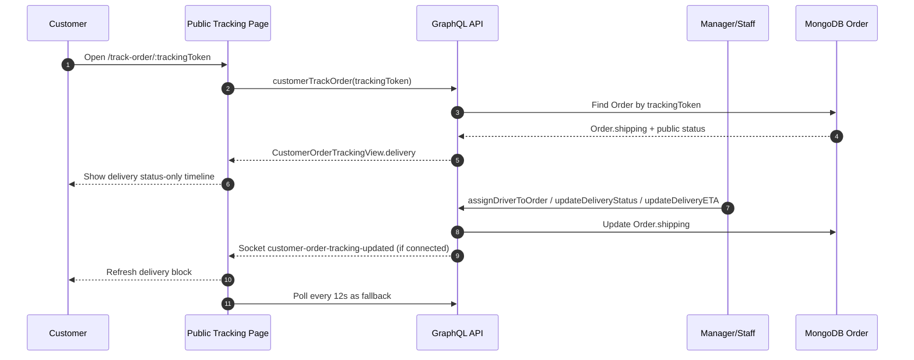

# Delivery order tracking status-only

## 1. Scope

Luồng tracking giao hàng trong scope đồ án này là **status-only delivery tracking**:

- Không phát triển app tài xế riêng.
- Không có live map/GPS realtime cho khách hàng.
- Không tracking route thực tế như Grab/ShopeeFood.
- Khách hàng mở link tracking công khai để xem trạng thái giao hàng, ETA, khoảng cách, thời lượng và thông tin người giao nếu nhà hàng đã cập nhật.
- Trạng thái giao hàng được cập nhật thủ công bởi manager/staff hoặc bởi hệ thống nội bộ thông qua GraphQL mutations hiện có.

## 2. Data source

Public tracking lấy dữ liệu an toàn từ đơn hàng:

- `Order.shipping.deliveryStatus`: trạng thái giao hàng chính.
- `Order.shipping.eta`: thời gian dự kiến đến nơi nếu có.
- `Order.shipping.distance`: khoảng cách dự kiến nếu có.
- `Order.shipping.duration`: thời lượng dự kiến nếu có.
- `Order.shipping.driverName`, `driverPhone`, `driverVehiclePlate`: thông tin người giao nếu đã phân công.
- `Order.shipping.externalTrackingCode`: mã tracking ngoài nếu nhà hàng nhập.
- `Order.statusHistory` / `publicStatus`: trạng thái public tổng quát của đơn.

Public payload **không trả** `trackingToken` nội bộ, `_id` nội bộ hoặc `shipping.driverLocation.lat/lng`.

## 3. Flow nghiệp vụ

1. Customer đặt đơn `delivery`.
2. Nhà hàng nhận đơn và xác nhận.
3. Bếp chuẩn bị món.
4. Manager/staff phân công người giao bằng `assignDriverToOrder`.
5. Manager/staff cập nhật các bước giao hàng bằng `updateDeliveryStatus`:
   - `driver_assigned`
   - `driver_arriving`
   - `picked_up`
   - `delivering`
   - `arrived`
   - `delivered`
   - `cancelled` / `failed`
6. Manager/staff cập nhật ETA/khoảng cách/thời lượng bằng `updateDeliveryETA` nếu có dữ liệu.
7. Customer mở link tracking để xem block **Thông tin giao hàng** và timeline trạng thái.
8. Frontend ưu tiên socket room theo `trackingToken`; nếu socket không hoạt động thì polling 12 giây vẫn cập nhật dữ liệu.

## 4. Mermaid sequence diagram



## 5. GraphQL mutation mẫu để demo

### Phân công người giao

```graphql
mutation AssignDriverToOrder($input: AssignDriverToOrderInput!) {
  assignDriverToOrder(input: $input)
}
```

Variables:

```json
{
  "input": {
    "restaurantId": "<restaurant-id>",
    "orderId": "<delivery-order-id>",
    "driverName": "Anh Nam",
    "driverPhone": "0909000111",
    "driverVehiclePlate": "59A1-12345",
    "channel": "manual_demo"
  }
}
```

### Cập nhật trạng thái giao hàng

```graphql
mutation UpdateDeliveryStatus($input: UpdateDeliveryStatusInput!) {
  updateDeliveryStatus(input: $input)
}
```

Variables:

```json
{
  "input": {
    "restaurantId": "<restaurant-id>",
    "orderId": "<delivery-order-id>",
    "status": "delivering",
    "message": "Người giao đang giao đến khách"
  }
}
```

### Cập nhật ETA/khoảng cách/thời lượng

```graphql
mutation UpdateDeliveryETA($input: UpdateDeliveryETAInput!) {
  updateDeliveryETA(input: $input)
}
```

Variables:

```json
{
  "input": {
    "restaurantId": "<restaurant-id>",
    "orderId": "<delivery-order-id>",
    "eta": "2026-06-01T12:30:00.000Z",
    "distance": 4.2,
    "duration": 18
  }
}
```

## 6. Test checklist

- `customerTrackOrder` trả `delivery` cho đơn `orderType = delivery`.
- Đơn `dine_in` / `takeaway` trả `delivery = null`.
- `deliveryStatus = delivering` hiển thị “Đang giao đến bạn”.
- `deliveryStatus = delivered` hiển thị “Giao hàng thành công”.
- Public payload không chứa tọa độ GPS tài xế.
- Socket `join-order-tracking` validate bằng `Order.trackingToken`, không dùng `OrderTracking.trackingToken`.
- Polling 12 giây vẫn là fallback khi socket lỗi.

## 7. Limitations

- Không GPS live.
- Không bản đồ.
- Không tích hợp provider giao hàng thật.
- ETA/distance/duration là dữ liệu nhập/cập nhật từ hệ thống hoặc nhân viên, chưa tự tính route bằng Google Maps/Nominatim.
- Không có app tài xế để cập nhật vị trí liên tục.
