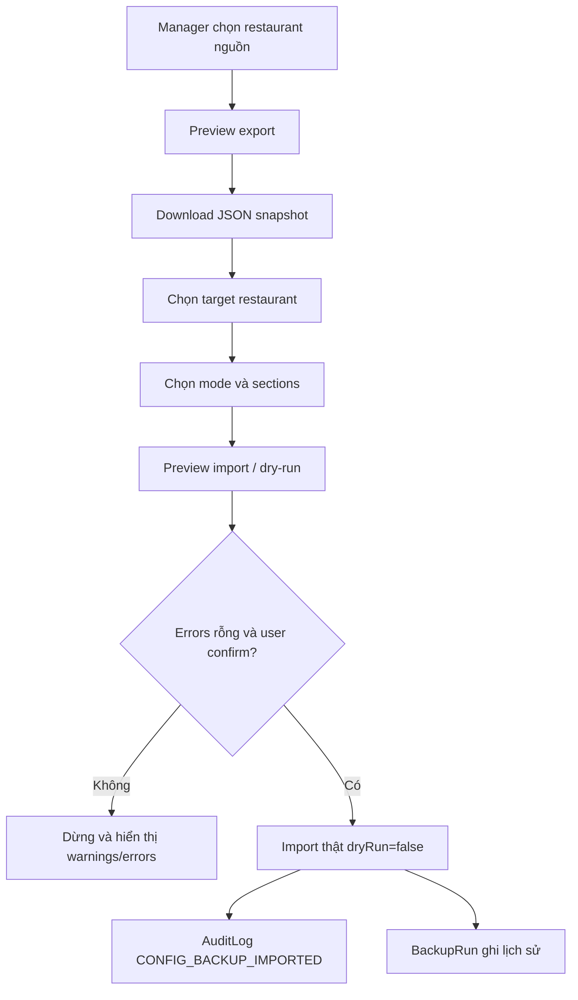

# Restaurant Configuration Snapshot: sao lưu và khôi phục cấu hình

## 1. Mục tiêu

Tính năng này tạo **Restaurant Configuration Snapshot** để:

- Sao lưu cấu hình nhà hàng thành file JSON UTF-8 tải về máy.
- Copy cấu hình từ một nhà hàng sang nhà hàng khác.
- Khôi phục cấu hình cho cùng nhà hàng sau khi đã preview/dry-run.

Đây **không phải full database backup** và không thay thế backup hạ tầng cho dữ liệu vận hành.

## 2. Phân biệt DB backup hạ tầng và Config snapshot trong app

| Nội dung | DB backup hạ tầng | Restaurant Configuration Snapshot |
| --- | --- | --- |
| Mục tiêu | Khôi phục toàn bộ database khi sự cố hạ tầng | Export/import cấu hình nhà hàng trong app |
| Dữ liệu vận hành | Có thể gồm orders, payments, reviews, logs | Không bao gồm mặc định |
| Định dạng | Theo công cụ DB/infra | JSON UTF-8 tải về máy |
| Người dùng chính | DevOps/admin hệ thống | Manager/admin nhà hàng |
| Luồng an toàn | Restore theo quy trình hạ tầng | Preview/dry-run trước khi import |

## 3. Sections được export/import

Snapshot hỗ trợ các section cấu hình sau:

1. **restaurantProfile**: tên, ảnh, địa chỉ, liên hệ, tiện ích, giờ mở cửa, policies, capabilities, timezone, currency, payment/reservation/AI settings đã loại bỏ secret.
2. **systemSettings**: `SystemSetting` theo `restaurantId`.
3. **printSettings**: `PrintSetting` gồm printers, stations, templates, jobs. Device id/local IP có thể cần chỉnh lại sau restore.
4. **customerRankSettings**: cấu hình hạng khách hàng.
5. **payrollSettings**: cấu hình lương, không gồm kỳ lương, phiếu lương hoặc thanh toán lương.
6. **schedulingPolicy**: chính sách xếp ca.
7. **floorTableLayout**: tầng và bàn; clone sẽ remap floor và reset trạng thái runtime của bàn.
8. **menuCatalog**: menu, category, category menu, món, modifier groups, combo, recipe cơ bản.
9. **inventoryMaster**: warehouse, ingredient category, ingredient, supply category, supply; không gồm stock movements/balances mặc định.
10. **promotionConfig**: promotion, coupon, voucher package; clone reset usage counters.
11. **aiChatbotConfig**: AI settings, knowledge items, safety rules, evaluation cases; không gồm chat conversation/history.

## 4. Những gì không export

Snapshot không export dữ liệu nhạy cảm hoặc dữ liệu phát sinh mặc định:

- Orders, payments, invoices, reservations, reviews.
- Notifications, audit logs, chat history.
- Customer private data và staff personal data đầy đủ.
- `passwordHash`, `refreshToken`, verify token, tracking token, driver location.
- Payment provider secrets/API keys/env secrets.
- Stock movements/stock balances, payroll periods/payments/items.
- Coupon redemption/user coupon mặc định.
- Rating/review-derived counters như `avgRating`, `reviewCount`, `rate`, `orderCounter` khi clone.

## 5. Quy trình export

1. Manager/admin mở **Sao lưu & khôi phục cấu hình**.
2. Chọn nhà hàng nguồn.
3. Chọn section cần export.
4. Bấm **Xem trước** để xem counts/warnings.
5. Bấm **Tải file backup JSON**.
6. Lưu file JSON và checksum ở nơi an toàn.

## 6. Quy trình import/clone sang nhà hàng khác

1. Chọn file snapshot JSON từ máy.
2. Chọn nhà hàng đích.
3. Chọn mode **Clone sang nhà hàng này**.
4. Chọn section cần import.
5. Bấm **Preview import** để xem create/update/skip/warnings/errors.
6. Tick xác nhận “Tôi hiểu import có thể ghi đè cấu hình hiện tại”.
7. Bấm **Import thật**.
8. Kiểm tra lại cấu hình máy in, menu, bàn, AI chatbot và các mapping sau import.

Trong clone mode, hệ thống không dùng lại `_id` cũ; các `_id` trong snapshot chỉ là `legacyId` để remap. Runtime counters/status được reset để tránh kéo dữ liệu vận hành sang nhà hàng mới.

Các mapping quan trọng khi clone:

- Floor được remap trước rồi Table dùng `floorId` mới; nếu không map được floor thì table bị bỏ qua kèm warning.
- Menu và Category được remap trước rồi MenuItem dùng `menuId`/`categoryId` mới; nếu không map được menu/category bắt buộc thì menu item bị bỏ qua kèm warning.
- Inventory Ingredient được remap trước Recipe; `servingVariants[].ingredients[].ingredientId` được đổi sang Ingredient mới.
- Menu/Category/MenuItem được remap trước Promotion/Coupon; các field như `categoryId`, `itemId`, `giftItemId`, `comboItems[].itemId` và constraints coupon chứa `categoryIds`, `itemIds`, `menuItemIds` được đổi sang id mới.

Nếu một source ObjectId không remap được, hệ thống không giữ ObjectId của nhà hàng nguồn trong nhà hàng đích. Reference đó sẽ bị bỏ/skip và trả warning để manager kiểm tra lại sau import.

## 7. Quy trình restore cùng nhà hàng

1. Chọn file snapshot có `source.restaurantId` trùng nhà hàng đích.
2. Chọn mode **Khôi phục cùng nhà hàng**.
3. Preview để kiểm tra thay đổi.
4. Xác nhận và import thật nếu errors rỗng.

Nếu source restaurant khác target restaurant, mode `same_restaurant_restore` bị reject để tránh restore nhầm.

## 8. Dry-run/preview

Preview/dry-run là bước bắt buộc về mặt UX:

- GraphQL input mặc định `dryRun=true`.
- Preview không ghi database.
- Import thật chỉ chạy khi client gửi `dryRun=false` và người dùng xác nhận.
- Replace mode yêu cầu `replaceExisting=true`.

## 9. Checksum

Snapshot có checksum dạng `sha256:...` tính trên canonical JSON không gồm trường `checksum`. Khi import, backend verify checksum để phát hiện file bị sửa hoặc hỏng.

## 10. Rủi ro và best practices

- Luôn preview trước khi import thật.
- Không dùng Config snapshot thay cho database backup vận hành.
- Sau clone cần kiểm tra máy in local IP/device id, print station, tích hợp thanh toán, giờ mở cửa đặc biệt và AI chatbot.
- Recipe ingredient links cần chọn kèm `inventoryMaster`; nếu không, ingredient lines không remap được sẽ bị bỏ và có warning.
- Promotion/Coupon item/category links cần chọn kèm `menuCatalog`; nếu không, refs menu/category/item không remap được sẽ bị bỏ và có warning.
- Clone reset runtime fields như table `status`/`viewLock`, promotion/coupon/voucher `usageCount`/`used`, và menu item `orderCounter`/`rate`.
- Không chia sẻ file snapshot nếu có cấu hình nội bộ như địa chỉ, email, số điện thoại hoặc thông tin thiết bị in.
- Dùng replace mode cẩn thận vì mode này xóa cấu hình trong section đã chọn của target restaurant trước khi import.

## 11. Mermaid flow

## 12. Checklist test thủ công

- Export full sections và mở file JSON kiểm tra `kind`, `schemaVersion`, `counts`, `checksum`.
- Tìm trong file để bảo đảm không có `passwordHash`, token, payment secret.
- Import preview file hợp lệ vào nhà hàng khác với mode clone.
- Import clone thật và kiểm tra SystemSetting, PrintSetting, Floor/Table, Menu/Recipe, SchedulingPolicy, PayrollSetting, CustomerRankSetting, AI chatbot config.
- Kiểm tra table status về `available` và usage counters/rating-derived counters được reset.
- Thử sửa file JSON sau export rồi import để xác nhận checksum mismatch.
- Thử same-restaurant restore với target khác source để xác nhận bị reject.
- Thử replace mode không tick xác nhận để xác nhận bị reject.

## 13. Import Conflict Resolver

Conflict Resolver xuất hiện trong bước **Preview import** khi target restaurant đã có cấu hình trùng key hoặc khác dữ liệu so với file snapshot.

### Khi nào có conflict

- Target đã có Floor cùng `level`/`name`, Table cùng `code`, Menu cùng `timeSlot`/`name`, Category cùng `name`.
- Target đã có MenuItem cùng `code`/`name`, Ingredient cùng `sku`/`name`, Promotion/Coupon cùng `code`.
- Target đã có AI knowledge cùng `title`/`question` hoặc safety rule cùng `ruleType + pattern`.
- Singleton settings như SystemSetting, PrintSetting, PayrollSetting, SchedulingPolicy, CustomerRankSetting, Restaurant profile hoặc AI chatbot settings khác dữ liệu trong file.
- Reference phụ thuộc không map được, ví dụ recipe ingredient, promotion item/category hoặc table floor.

### Ý nghĩa các resolution

- `use_source`: dùng dữ liệu trong file snapshot để ghi đè/upsert target.
- `keep_target`: giữ cấu hình hiện tại ở target; source `legacyId` vẫn map sang target id nếu record là dependency cho record khác.
- `merge`: merge an toàn dạng shallow/safe merge; primitive source có thể overwrite target nếu source có value.
- `create_copy`: tạo bản sao mới nếu entity hỗ trợ, ví dụ `PHO` thành `PHO-copy` hoặc tên thành `(copy)`.
- `rename_source`: tạo bản mới với tên/code mới do người dùng nhập.
- `skip`: bỏ qua record trong file snapshot; dependent records có thể bị skip/warning nếu mất mapping.
- `replace_section`: chỉ dùng với replace mode và `replaceExisting=true`.

### Field diff

Preview chỉ hiển thị field diff ngắn, tối đa preview khoảng 120 ký tự. Hệ thống bỏ qua runtime/sensitive fields như `orderCounter`, `rate`, `usageCount`, `used`, `avgRating`, `reviewCount`, token, password hash và secret.

### Bulk actions trong UI

- **Apply default**: trả mọi conflict về default resolution an toàn.
- **Keep all target**: giữ target cho conflict hỗ trợ `keep_target`.
- **Use all source**: dùng source cho conflict hỗ trợ `use_source`.
- **Merge all safe conflicts**: merge các conflict không blocking.
- **Skip all warning conflicts**: skip conflict severity warning nếu entity cho phép.

### Ví dụ clone menu đã có món PHO

Nếu target đã có MenuItem `PHO` giá 55.000đ và snapshot có `PHO` giá 50.000đ, preview sẽ hiển thị conflict `menuCatalog:MenuItem:PHO` với field diff `basePrice`.

- Chọn `keep_target`: giữ món target; Recipe trong snapshot vẫn map sang MenuItem target hiện có.
- Chọn `use_source`: cập nhật target bằng dữ liệu từ snapshot.
- Chọn `rename_source`: nhập `PHO-NEW` để tạo món mới và map Recipe sang món mới.
- Chọn `skip`: bỏ món source; Recipe phụ thuộc vào món đó sẽ bị skip và có warning.

### Dependency mapping

- `keep_target` vẫn map dependency sang id hiện có ở target, ví dụ Floor -> Table, MenuItem -> Recipe.
- `merge`/`use_source` map sang record được update/upsert.
- `create_copy`/`rename_source` map sang bản ghi mới.
- `skip` không tạo mapping; dependent records sẽ skip hoặc remove ref để không giữ ObjectId của nhà hàng nguồn.

### Best practices

- Clone lần đầu sang target đã có dữ liệu nên ưu tiên `keep_target` cho record target đang vận hành.
- Restore cùng nhà hàng có thể dùng `use_source` sau khi đã review diff.
- Luôn đọc warnings/errors trước khi import thật.
- Với coupon constraints dạng Mixed, hệ thống remap best-effort các key phổ biến như `categoryId(s)`, `itemId(s)`, `menuItemId(s)`, `giftItemId`.

### Limitations

- `merge` hiện là shallow/safe merge, chưa phải semantic merge cho mọi field lồng sâu.
- `create_copy` dùng suffix an toàn cơ bản như `-copy` hoặc `(copy)`; nếu target có nhiều bản copy, manager nên rename rõ ràng bằng `rename_source`.
- Conflict Resolver không thay thế quy trình kiểm thử thủ công sau import với máy in, payment provider, coupon constraints phức tạp và AI chatbot settings.
