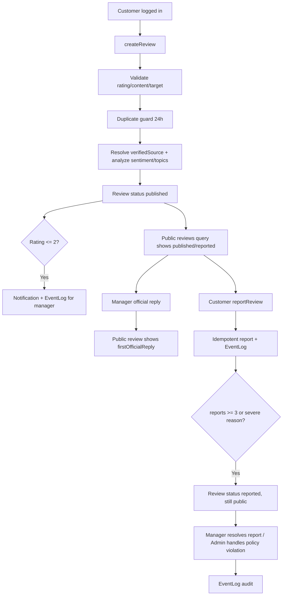

# Review Module Graduation Demo

Module Review giúp khách hàng gửi đánh giá sau trải nghiệm, nhà hàng phản hồi công khai, xử lý báo cáo nội dung xấu và dùng dữ liệu đánh giá làm evidence tham khảo trong dashboard hiệu suất nhân viên.

## Mục tiêu nghiệp vụ minh bạch

- Customer gửi review sau khi đăng nhập; backend validate target/restaurant/rating/content và lưu `published` ngay.
- Review `published` hiển thị ngay trong public reviews query, không cần manager duyệt trước.
- Manager không có luồng che giấu review xấu bằng cách approve/reject/hide tùy ý; trọng tâm là phản hồi chính thức, theo dõi analytics và hậu kiểm report.
- Review `reported` vẫn hiển thị public với badge/cảnh báo “Đang được xem xét”; chỉ Admin mới được ẩn/từ chối khi có lý do vi phạm chính sách rõ ràng.
- Report flow, duplicate guard 24 giờ, verified purchase/source, sentiment/topic tags, notification và EventLog vẫn là lớp chống spam/chống phá/audit.

## Demo flow đề xuất

1. **Customer gửi review công khai ngay**: gửi review nhà hàng/món/dịch vụ; kết quả mutation trả `status = published`.
2. **Public query thấy review mới ngay**: mở trang RestaurantDetail/FoodDetail, review mới xuất hiện mà không cần approve.
3. **Review tiêu cực tạo cảnh báo**: review 1–2 sao vẫn public nhưng tạo Notification/EventLog cho manager để phản hồi.
4. **Manager phản hồi chính thức**: manager tạo official reply; public review hiển thị phản hồi đầu tiên của nhà hàng.
5. **Report nội dung xấu**: customer report review. Cùng `reviewId + reporterUserId + reason` là idempotent, không spam counter.
6. **Hậu kiểm report**: nếu nhiều report hoặc reason nghiêm trọng (`abuse`, `offensive`, `privacy`), review chuyển `reported` nhưng vẫn public với trạng thái đang xem xét.
7. **Admin xử lý vi phạm rõ ràng**: Admin có thể `hidden/rejected` khi có policy reason rõ ràng; mọi xử lý ghi EventLog.
8. **Analytics đánh giá**: ReviewManagement hiển thị tổng quan, đánh giá cần phản hồi, báo cáo cần xử lý và review rủi ro cao.

## Sequence diagram



## Permission summary

| Role | Create review | Public read | Reply official | Moderate status | Read reports | Resolve reports | Analytics | Export |
|---|---:|---:|---:|---:|---:|---:|---:|---:|
| Guest | No | `published/reported` | No | No | No | No | No | No |
| Customer | Yes | `published/reported` + own review | No | Own delete/update where allowed | Report only | No | No | No |
| Staff/Manager | No customer spoofing | Restaurant scope | Yes | Report-backed `reported` or internal note only | Yes | Yes if permission | Yes | Yes if permission |
| Admin | No customer spoofing | All scoped/global | Yes | `hidden/rejected` only with clear policy reason | Yes | Yes | Yes | Yes |

## GraphQL operations to demonstrate

- `createReview(input)` returns `status: published` immediately.
- `reviews(restaurantId, status: "published")` returns public-visible `published` and `reported` reviews for customer/public callers.
- `createReviewComment(input: { officialReply: true })` adds restaurant official reply.
- `reportReview(id, input)` creates or updates an idempotent report by `reviewId + reporterUserId + reason`.
- `resolveReviewReport(id, input)` resolves/rejects report and recalculates pending report count without arbitrarily hiding the review.
- `setReviewStatus(id, status, reason, moderationNote)` is restricted: no manager approve flow; manager cannot hide/reject bad reviews; Admin policy actions require a clear reason.
- `reviewAnalytics`, `reviewReports`, `reviewReportStats`, `reviewTimeline` provide hậu kiểm, SLA and audit evidence.

## Demo checklist

1. Seed roles/permissions including `review.read`, `review.reply`, `review.report.read`, `review.report.resolve`, `review.analytics.read`, `review.export`.
2. Login as customer and create a 2-star review.
3. Confirm mutation returns `published` and public query shows the review immediately.
4. Confirm manager notification/EventLog exists for negative review.
5. Login as manager and add official reply; public review shows `firstOfficialReply`.
6. Report same review twice with same reason/user; `reportsCount` must not increase on duplicate.
7. Report with `privacy`/`abuse`/`offensive` or accumulate at least 3 pending reports; review becomes `reported` but remains public.
8. Resolve/reject report and verify EventLog timeline.
9. Verify ReviewManagement focuses on “Tổng quan đánh giá”, “Đánh giá cần phản hồi”, “Báo cáo cần xử lý”, “Review rủi ro cao”.
10. Verify there is no manager approve button/queue in the normal review submission flow.

## Smoke command

```bash
GRAPHQL_ENDPOINT=http://localhost:4000/graphql \
CUSTOMER_TOKEN=... \
MANAGER_TOKEN=... \
DEMO_RESTAURANT_ID=... \
node scripts/review-flow-smoke.mjs --strict
```

Dry-run guidance:

```bash
node scripts/review-flow-smoke.mjs --dry-run
```

## Acceptance evidence

- Customer review status is `published` immediately.
- Public reviews include `published` and `reported` reviews.
- Manager does not approve before public visibility.
- Negative review remains public and generates Notification/EventLog.
- Duplicate review within 24 hours is rejected.
- Duplicate report by same user/reason is idempotent.
- Severe/multiple reports move review to `reported` without auto-hide.
- Official reply remains visible on public review.
- Admin-only policy moderation is audited via EventLog.
