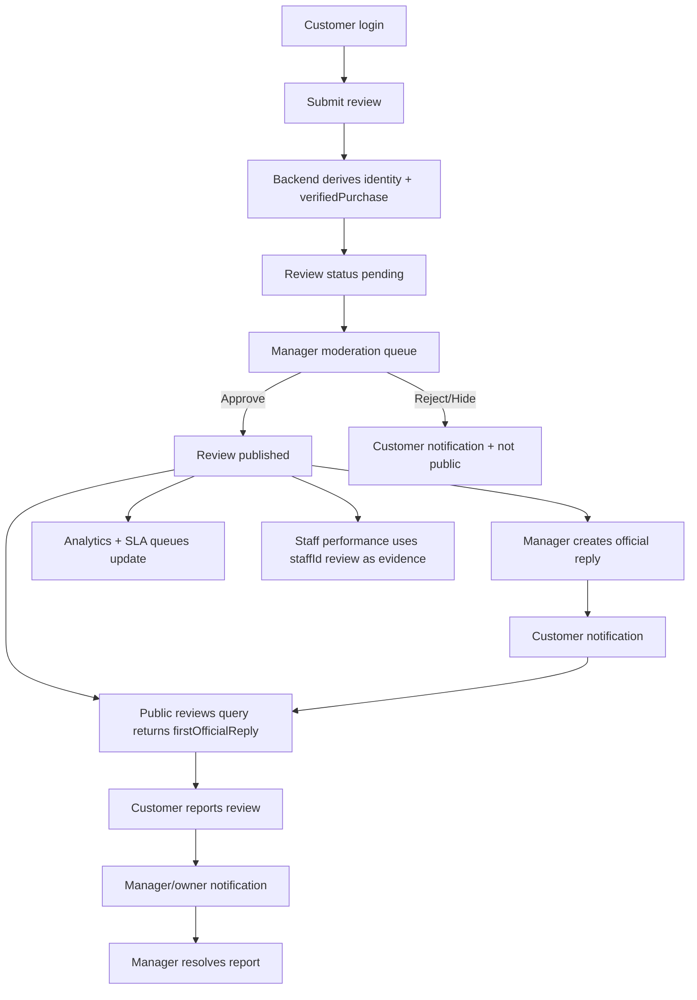

# Review/Rating/Feedback module — Graduation demo guide

## 1. Mục tiêu module

Module Review giúp khách hàng gửi đánh giá sau trải nghiệm, nhà hàng kiểm duyệt/phản hồi, quản lý báo cáo nội dung xấu và dùng dữ liệu đánh giá làm evidence tham khảo trong dashboard hiệu suất nhân viên.

Mức hoàn thiện sau PR này tập trung vào demo đồ án:

- Customer gửi review có kiểm tra đăng nhập và trạng thái `pending`.
- Manager duyệt/từ chối/ẩn review, phản hồi chính thức, xem queue SLA và analytics.
- Public list hiển thị `firstOfficialReply` trực tiếp từ query reviews để tránh N+1 request.
- In-app Notification/EventLog hook cho các sự kiện review chính.
- Service review có bộ target tối thiểu: `service_quality`, `serving_speed`, `cleanliness`, `payment`, `booking`, `delivery`.
- Seed data an toàn cho kịch bản demo nhanh.

## 2. Use cases chính

1. **Khách đăng review**: khách đăng nhập, nhập rating/nội dung, có thể gắn nhân viên; backend tự derive customer identity và verified purchase.
2. **Quản lý duyệt review**: manager vào ReviewManagement, lọc `Chờ duyệt`, duyệt hoặc reject kèm lý do.
3. **Nhà hàng phản hồi**: manager mở chi tiết review và tạo official reply; public thấy badge “Phản hồi từ nhà hàng”.
4. **Khách báo cáo review**: khách đăng nhập bấm báo cáo, duplicate report không làm spam counter.
5. **Quản lý xử lý report**: manager xem queue/report, resolve hoặc reject report.
6. **Analytics đánh giá**: ReviewManagement hiển thị tổng quan, issue tags, queue, high risk và trend.
7. **Staff performance evidence**: review có `staffId` xuất hiện như evidence tham khảo khi tính hiệu suất nhân viên.

## 3. Sơ đồ luồng nghiệp vụ



## 4. Permission matrix

| Actor | Submit review | React/helpful/report | Read public reviews | Moderate | Reply official | Read reports | Resolve reports | Analytics | Export CSV |
|---|---:|---:|---:|---:|---:|---:|---:|---:|---:|
| Guest | No | No | Yes | No | No | No | No | No | No |
| Customer | Yes | Yes | Yes | Own pending/rejected only | No | No | No | No | No |
| Staff/Manager | No customer spoofing | Yes | Yes | `review.moderate` | `review.reply` | `review.report.read` | `review.report.resolve` | `review.analytics.read` | `review.export` |
| Admin | Yes if authenticated | Yes | Yes | All restaurants | All restaurants | All restaurants | All restaurants | All restaurants | Yes |

## 5. API chính

- `reviews(restaurantId, targetType, status, minRating, maxRating, limit, skip)` returns `Review.firstOfficialReply` to avoid frontend N+1 comment queries.
- `reviewStats(restaurantId, targetType, targetId)` powers public rating overview.
- `reviewAnalytics(restaurantId, targetType, dateFrom, dateTo)` powers manager cards, issue tables and queue counts.
- `createReview(input)` creates pending customer review and negative-review notification hook.
- `setReviewStatus(id, status, reason, moderationNote)` approves/rejects/hides and notifies the customer.
- `createReviewComment(input)` creates normal comment or `officialReply` and notifies the customer.
- `reportReview(id, input)` creates idempotent report and notifies manager/owner.
- `resolveReviewReport(id, input)` resolves report without accidentally publishing hidden/rejected reviews.

## 6. Test cases trọng tâm

- Public review list renders first official reply from `reviews` query and does not call `GetReviewComments` per review.
- `firstOfficialReply` ignores normal comments and unpublished comments.
- Negative review creates manager notification/EventLog hook.
- Approve/reject creates customer notification/EventLog hook.
- Official reply creates customer notification/EventLog hook.
- Service target slug/id is accepted only for the configured service targets.
- Analytics counts `needsReply`, `highRisk`, `negativeCount`, `pendingCount` correctly.

## 7. Demo script từng bước

1. Run seed script in a local/staging database:
   ```bash
   SEED_REVIEW_DEMO=true node cohan-restaurant-backend/scripts/seedReviewDemoData.js
   ```
2. Login as manager demo account or an existing manager with permissions.
3. Open **Dashboard Manager → ReviewManagement**.
4. Select restaurant **Cohan Graduation Review Demo**.
5. Capture **Tổng quan đánh giá** cards and queue.
6. Open tab **Chờ duyệt**, approve one pending review.
7. Open published negative review, add official reply.
8. Switch to customer/public restaurant page; verify official reply badge appears without per-review comment query.
9. Login as customer and report a published review.
10. Return manager page; verify report/high-risk queue and resolve report.
11. Open staff performance demo; verify a review with staff evidence can be referenced.

## 8. Dữ liệu mẫu cần có

Seed script creates:

- 1 restaurant: `Cohan Graduation Review Demo`.
- 10 reviews total: 8 published-ish demo rows, 2 pending, at least 2 negative.
- 1 reported review and one pending report.
- 2 official replies.
- 1 staff-linked review.
- Mixed verified/non-verified reviews.
- Topic tags: `service_speed`, `food_quality`, `staff_attitude`, `cleanliness`, `payment`, `price`, `ambience`, `booking`, `delivery`.

## 9. Known limitations còn lại

- Email provider thật chưa được tích hợp; PR này dùng in-app Notification/EventLog hook để demo và báo cáo.
- Service target là constant lightweight, chưa phải CRUD service catalog đầy đủ.
- Analytics dùng card/table/progress thay vì chart library nặng để tránh tăng dependency.
- Official reply field trả reply đầu tiên; thread comment đầy đủ vẫn dùng `reviewComments` trong modal chi tiết.

## 10. Ảnh chụp màn hình nên đưa vào báo cáo

- Customer review list có verified badge và official reply card.
- Customer report modal.
- Manager ReviewManagement analytics section.
- Manager queue/SLA cards.
- Pending review approval action.
- Official reply creation modal.
- Report resolving flow.
- Staff performance evidence showing customer review reference.
- EventLog/Notification record for approved/rejected/reported/replied events.
