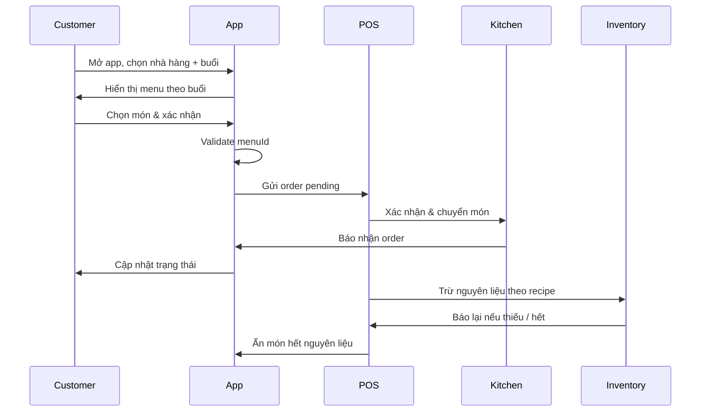

# 🍽️ FoodHub Order Flow – Customer to POS Integration

## 1. Tổng quan ý tưởng

Hệ thống cho phép **khách hàng trong nhà hàng** đặt món trực tiếp thông qua **ứng dụng di động**, hoặc nhân viên order giúp trên cùng hệ thống.  
Toàn bộ quy trình đảm bảo **menu theo từng buổi**, **đồng bộ kho nguyên liệu**, **cảnh báo hết món**, và **tích hợp POS → bếp/bar/grill** trong thời gian thực.

---

## 2. Quy trình người dùng

### 🧍‍♂️ Bước 1: Khách hàng mở app

- Mở ứng dụng FoodHub / Restaurant App.
- Chọn **nhà hàng hiện tại** (dựa trên định vị GPS hoặc QR bàn).
- Chọn **buổi ăn**: sáng / trưa / tối / khuya.

### 🍱 Bước 2: Xem menu theo buổi

- Ứng dụng hiển thị **menu tương ứng với buổi hiện tại** (`menuId` theo buổi).
- Mỗi món ăn hiển thị:
  - Mã món (`dishCode`)
  - Tên món
  - Cách chế biến / tùy chọn (modifiers)
  - Giá và hình ảnh minh họa

### 🛒 Bước 3: Chọn món ăn

- Khách hàng chọn món ăn → thêm vào giỏ hàng (cart).
- Hệ thống kiểm tra **menuId hợp lệ**:

  - Nếu `dish.menuId !== currentMenuId` → báo lỗi:
    > “Món này không có trong thực đơn của thời điểm hiện tại.”
  - Nếu hợp lệ → cho phép thêm.

- Order có thể được thực hiện:
  - ✅ Tự order (self-service)
  - ✅ Nhân viên order giúp (waiter-assisted)

---

## 3. Tạo đơn hàng (Order Creation)

### 📦 Khi khách hàng xác nhận giỏ hàng:

- Sinh **Order mới** ở trạng thái `pending`.
- Gửi thông báo đến POS:
- POS xác nhận (`confirmed`) → gửi order đến:
- 👨‍🍳 Bếp (kitchen)
- 🍹 Quầy bar
- 🍖 Khu nướng (grill)
- Sau khi POS xác nhận, giao diện waiter cập nhật:
  > “Đơn của bàn XX đã được nhận.”

---

## 4. Tương tác của nhân viên

### 👩‍🍳 Waiter view:

- Có thể xem toàn bộ món trong bàn.
- Có thể **thêm món** (append vào order).
- Không thể xóa món trực tiếp.
- Khi xóa cần **gửi thông báo lý do** đến POS (ghi log sự kiện “delete request”).

---

## 5. Theo dõi đơn hàng

### 👤 Khách hàng:

- Nếu order bằng tài khoản → có thể xem lịch sử và trạng thái đơn.
- Nếu không có tài khoản → có thể nhập **SĐT** để liên kết order với user profile (map user–phone).

### 🔄 Cập nhật trạng thái:

- POS → Kitchen → App → UI waiter / khách hàng.
- Các trạng thái khả dụng:

---

## 6. Quản lý nguyên liệu (Inventory Sync)

### ⚙️ Khi order được xác nhận:

- Hệ thống duyệt qua từng món:
- Lấy **recipe** tương ứng (đã được định nghĩa trước).
- Trừ nguyên liệu khỏi kho theo tỷ lệ định lượng.
- Tất cả nguyên liệu được **tổng hợp và trừ một lần** sau khi hoàn tất duyệt order.

### ⚠️ Nếu nguyên liệu không đủ:

- Tự động:
- Cảnh báo “Thiếu nguyên liệu” lên POS & Kitchen.
- Ẩn món khỏi menu khách hàng.
- Gửi thông báo:
  > “Món [Tên món] tạm thời hết nguyên liệu.”

---

## 7. Giỏ hàng & hoàn trả nguyên liệu

### 🕒 Giữ hàng (reservation):

- Món trong **giỏ hàng** được giữ trong **10 phút**.
- Nếu sau 10 phút không order:
- Tự động hoàn trả nguyên liệu về kho.
- Ghi log penalty (để tránh spam giữ hàng).
- Món không thể được “giữ lại” lại ngay lập tức.

---

## 8. Tóm tắt luồng xử lý

Tích hợp QR code bàn → auto-select tableId

Cho phép multi-session order (cùng bàn, nhiều người order riêng)

Thêm machine learning gợi ý món theo thói quen

Hỗ trợ offline mode khi mất mạng trong nhà hàng
